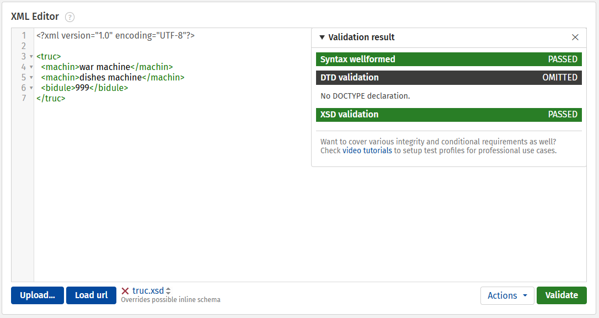
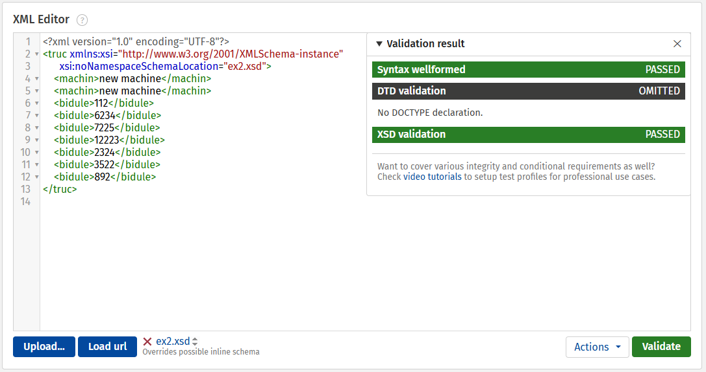

## Sujet 1

### 1 le premier code est valide



### 2 le deuxieme code est valide



## Sujet 2

- on vas ajouter le code suivant a `sujet2.xsd` pour inclure `repertoire`

```xml
<xsd:element name="repertoire" type="reportoireType"/>

<xsd:complexType name="reportoireType">
    <xsd:sequence>
        <xsd:element ref="personne" maxOccurs="unbounded"/>
    </xsd:sequence>
</xsd:complexType>
```

- on va couriger un error d'ajouter le `d` dans `xs` de la balise adresse.

```xml
<!-- avant -->

<!-- balise adresse -->
<xsd:element name="adresse">
    <xsd:complexType>
        <xsd:sequence>
            <xs:element ref="numero"/>
            <xs:element ref="voie"/>
            <xs:element ref="codePostal"/>
            <xs:element ref="ville"/>
            <xs:element ref="pays"/>
        </xs:sequence>
    </xs:complexType>
</xsd:element>

<!-- appres -->

<!-- balise adresse -->
<xsd:element name="adresse">
    <xsd:complexType>
        <xsd:sequence>
            <xsd:element ref="numero" />
            <xsd:element ref="voie" />
            <xsd:element ref="codePostal" />
            <xsd:element ref="ville" />
            <xsd:element ref="pays" />
        </xsd:sequence>
    </xsd:complexType>
</xsd:element>

```

- fin
